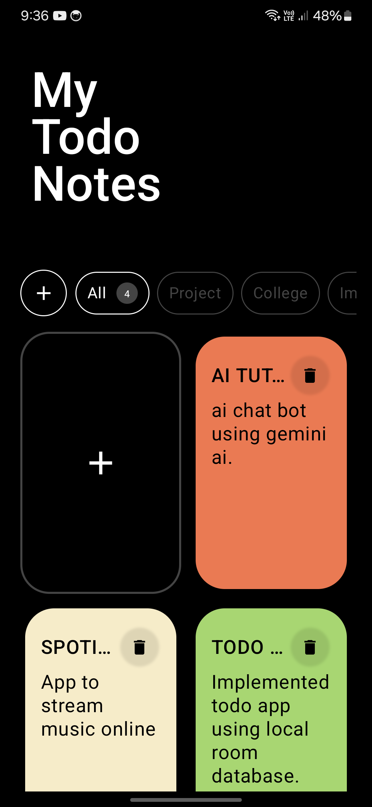
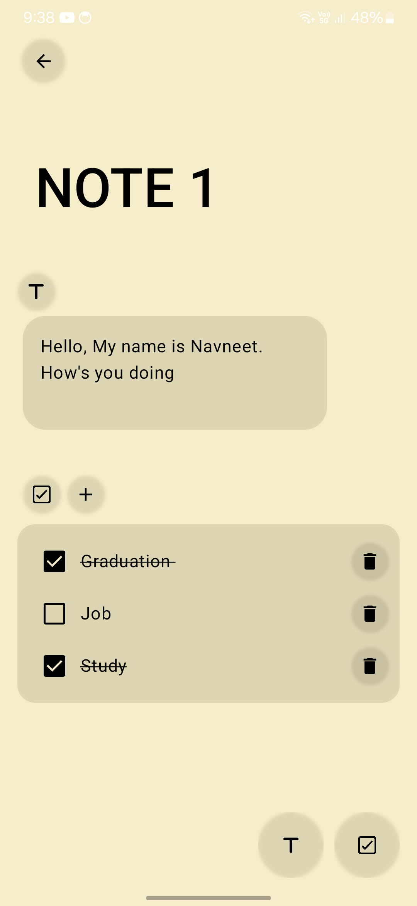
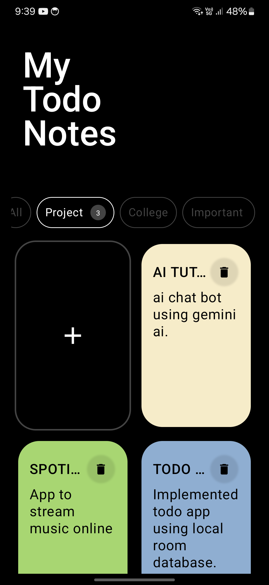

  
  <h3 align="center">Todo App</h3>

Todo App developed using Room Database with read, insert, update, or delete options and UI using Jetpack Compose

## Screenshots

  
  
  

<a href="https://drive.google.com/file/d/1hQXAJOZvquFGDck5nAVdF60eUXDPbMHR/view?usp=sharing" >  Download App</a>